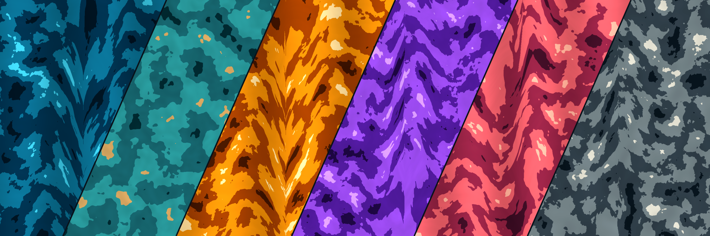

# Marbles

Marbles draws stone and planet like textures using layered Perlin noise. The same small set of texture equations can render a host of imagined worlds. 




The artwork is generated by the Python code in this repository. The offline
[marbles by MJD desktop app](marbledesk/README.md) provides an interactive editor and generator; its source, build files, assets, and app documentation live in
[`marbledesk/`](marbledesk/).

## The artwork

| Study            | What to look for                                     | Image                                    |
| ---------------- | ---------------------------------------------------- | ---------------------------------------- |
| Blue wallpaper   | Veins carried across a portrait canvas               | [PNG](shape_gallery/phone_blue.png)      |
| Golden wallpaper | Rich color regions at desktop scale                  | [PNG](shape_gallery/desktop_golden.png)  |
| Jupiter          | Horizontal flow and layered atmospheric bands        | [PNG](shape_gallery/desktop_jupiter.png) |
| Triangles        | The same texture clipped to regular polygon geometry | [PNG](shape_gallery/triangle_layout.png) |
| Hexagons         | Geometric tiling without transparent gaps            | [PNG](shape_gallery/hexagon_layout.png)  |

The [circle gallery](demo_gallery/) contains Carrara, black, green, pink, blue,
golden, and burgundy marble examples. The [shape gallery](shape_gallery/) includes
individual polygons, wallpapers, compositions, and a
[manifest](shape_gallery/manifest.json) of the settings used to make them.
The [texture study](texture_study/) varies frequency, complexity, and vein
strength to show how each changes the surface.

## How the image is made

The main renderer is [`marble_circles.py`](marble_circles.py). Each preset is a
`MarbleStyle`: an ordered palette, vein intensity, vein scale, noise complexity,
and texture scale. Seven presets evoke traditional stone; eight use planetary
palettes and additional flow patterns. A custom palette or style can replace a
preset.

For each pixel, the base field sums several layers of two-dimensional Perlin
noise. In simplified form, for row `y` and column `x`:

```text
B(y, x) = Σ[k = 0 … c−1] 2^(−k) · noise(
              (y + u_k) · s · t · 2^k,
              (x + v_k) · s · t · 2^k)
```

Here `c` is complexity, `s` is vein scale, and `t` is texture scale. Each octave
doubles the frequency and halves its weight. Offsets derived from the seed move
the pattern through noise space. Increasing texture scale makes features smaller
at a fixed canvas size.

A second noise field bends the sampling coordinates before the renderer samples
the veins. This makes them wander and branch instead of following a straight
grid. Planetary styles displace horizontal coordinates more strongly by latitude;
individual presets add bands, turbulence, terrain, or highlights. The base field
selects a color from the palette, while the vein field changes its brightness.
Finally, the renderer adds a subtle blur, contrast, and color enhancement.

Shape geometry comes from [`marble_shapes.py`](marble_shapes.py). Circles receive
an antialiased mask, lighting, and planetary glow where appropriate. Rectangles
fill the canvas. Polygons use supersampled coverage masks, leaving transparent
pixels outside the shape. [`marble_tiling.py`](marble_tiling.py) places triangle
and flat-top hexagon tiles using their polygon bounds and rasterizes touching
shapes on one canvas to avoid seams. Neighboring textures are geometrically
fitted, but their marble veins are not guaranteed to continue across an edge.

The desktop app uses the same core equations through a NumPy accelerated
renderer. See its [rendering notes](marbledesk/README.md#rendering-and-verification).

## Generate your own

Use Python 3.10 or newer. From the repository root:

```bash
python -m venv .venv
# Activate the environment, then:
python -m pip install -r requirements.txt
```

On Windows PowerShell, activate with `.venv\Scripts\Activate.ps1`; on macOS or
Linux, use `source .venv/bin/activate`. The `noise` dependency can require a C
compiler when a wheel is unavailable.

```bash
# Browse the 15 built-in styles.
python marble_circles.py --list-styles

# Render a classic circle or a planetary circle.
python marble_circles.py --style carrara --size 1024 --seed 42
python marble_circles.py --style jupiter --size 1024 --seed 42

# Fill a wallpaper; the image is rendered at its actual dimensions.
python marble_circles.py --shape rectangle --width 1920 --height 1080 --style golden --seed 202 --output wallpapers

# Render transparent polygon tiles.
python marble_circles.py --shape triangle --size 512 --style burgundy --seed 404 --output tiles
python marble_circles.py --shape hexagon --size 512 --style green --seed 606 --output tiles

# Supply a palette directly.
python marble_circles.py --colors "#143C40,#357C80,#C79764,#E9D7B5" --size 512
```

The main generator accepts 64–8192 pixels per dimension. Circles require a
square canvas. Existing PNGs receive numbered filenames rather than being
replaced.

## Explore variation

[`random_marble_generator.py`](random_marble_generator.py) produces collections
with random, analogous, complementary, triadic, or monochromatic palettes. It
also varies vein strength, frequency, complexity, and texture scale. Its
parameter study mode changes one control at a time.

```bash
python random_marble_generator.py --batch-size 10 --sizes 512,1024 --schemes analogous,triadic --seed 42
python random_marble_generator.py --explore-parameters --shape triangle --sizes 256 --output triangle_study
```

The [circle demo](demo.py) and [shape demo](demo_shapes.py) regenerate gallery
examples. `demo_shapes.py` also saves the settings and polygon geometry in a
manifest. Regenerate the README banner and its six source textures with
`python demo_banner.py --overwrite`; omit `--overwrite` to save a numbered copy.
The main renderer can be used directly from Python:

```python
from marble_circles import MarbleGenerator, MarbleStyle
from marble_shapes import save_png

style = MarbleStyle(
    "Patina", ["#143C40", "#357C80", "#C79764", "#E9D7B5"],
    vein_intensity=0.6, vein_scale=0.016, complexity=3, texture_scale=0.75,
)
image = MarbleGenerator(size=512, seed=505).generate_marble(
    shape="hexagon", custom_style=style
)
save_png(image, "tiles/patina_hexagon.png")
```

For reproducible new-shape images, provide a seed and keep dimensions and other
settings fixed. The original circle noise path remains available for
compatibility; `deterministic_noise=True` opts circles into the stable sampling
used for other shapes. A circle and a polygon with the same seed are not
pixel-identical crops.

## Repository map

| Path                                                | Role                                                      |
| --------------------------------------------------- | --------------------------------------------------------- |
| `marble_circles.py`                                 | Main texture equations, style presets, rendering, and CLI |
| `marble_shapes.py`, `marble_tiling.py`              | Masks, polygon geometry, and tile composition             |
| `random_marble_generator.py`                        | Palette generation, batches, and parameter studies        |
| `demo.py`, `demo_shapes.py`                         | Reproducible example artwork                              |
| `demo_gallery/`, `shape_gallery/`, `texture_study/` | Generated artwork and studies                             |
| [`marbledesk/`](marbledesk/)                        | Desktop app, its tests, assets, build, and documentation  |

Run the core checks with `python -m unittest discover -s tests -q`. The desktop
checks and packaging instructions are in the [app README](marbledesk/README.md).

## License

The project's code and associated documentation are licensed under the
[MIT License](LICENSE). The checked-in gallery PNGs in `demo_gallery/`,
`shape_gallery/`, and `texture_study/` are licensed separately under
[CC BY 4.0](LICENSE-ARTWORK.md). The "marbles by MJD" name and app icons are not
included in the gallery artwork license. Images you generate with the software
are not automatically subject to the gallery artwork license.

Third-party components retain their own licenses. See the desktop app's
[third-party notices](marbledesk/THIRD_PARTY_NOTICES.md) when distributing a
packaged app.
